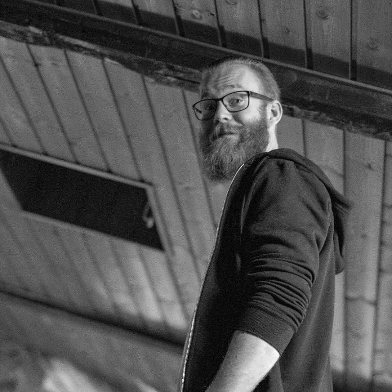

**Name:** Anton Levholm
**Occupation:** IT-consultant @ [Consid AB](https://consid.se)
**Favorite framework:** Next.js
**Preferred languages:** TypeScript, JavaScript and Python
**Cats or dogs?:** Cats

I've been working as a developer since 2016 while studying Software Engineering at Chalmers University of Technology. In 2019 I left my studies for working full time at Consid. Someday I might finish my degree, but today is not that day! Learning on the job and in personal projects works way better for me.

I believe in finding balance in life. No matter if it's work or personal hobbies we still need to find some time in between for recovery.
